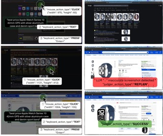
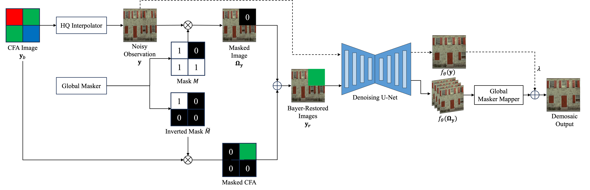

I am a first-year M.S. student in Electrical and Computer Engineering at the University of Michigan, Ann Arbor. Before joining UMich, I received my B.E. in Digital Media Technology from Communication University of China, advised by [Prof. Qi Mao](https://sites.google.com/view/qi-mao/).

My research focuses on designing efficient image compression frameworks and intelligent agents that bridge perception and action across domains. I have published in IEEE Transactions on Image Processing (TIP) and the Data Compression Conference (DCC), and contributed to multiple research projects in computer vision and large language models. 

I am seeking Ph.D. opportunities starting in Spring or Fall 2026 in computer vision, machine learning, and multi-modal AI.

## 📚 Education  

- **M.S. in Electrical and Computer Engineering**  
  *University of Michigan, Ann Arbor (Aug 2024 - Exp. Dec 2025)*  
  **(GPA: 3.95/4.0)**  
  Selected Coursework: Probability & Random Processes, Machine Learning, Matrix Methods for ML, Image Processing, Computer Vision

- **B.E. in Digital Media Technology** **(GPA: 3.77/4.0)**  
  *Communication University of China (Sept 2020 - June 2024)*  
  **First Class Scholarship**, School of Information and Communication Engineering (2020)  
  Selected Coursework: Machine Learning, Signal Processing, Data Structures & Algorithms, Linear Algebra, Probability & Statistics

## 🔬 Research  
### Deep Learning Group, Department of Computer Science Engineering
*University of Michigan, Ann Arbor | Research Intern (June 2025 - Ongoing)*  
**Advisor**: [Prof. Honglak Lee](http://web.eecs.umich.edu/~honglak/)  

**Video-to-Dataset Generation for Cross-Platform Computer Agents**
- Aims to scale MONDAY (CVPR 2025)’s video-to-dataset paradigm to desktop agents by enhancing the action understanding and annotation capability across platforms.  
- Rebuilt and modularized the original action identification pipeline to improve extensibility and maintainability. Migrated the pipeline from OpenAI APIs to local LLM inference using the vLLM framework, implemented an asynchronous, batch-supporting backend for efficient large-scale evaluation.  
- Collaborated with team members in redesigning GUI Action Space and corresponding prompt templates to accommodate desktop-specific UI behaviors, enhancing execution accuracy and robustness.

### Mobility Transformation Lab
*University of Michigan, Ann Arbor | Research Intern (Feb 2025 - Ongoing)*  
**Advisor**: [Prof. Henry Liu](https://traffic.engin.umich.edu)

**Language-Guided Corner Case Generation for Traffic Simulation**
- Led the development of a controllable traffic simulation framework that generates realistic corner cases from natural language input, enabling targeted scenario creation for autonomous vehicle testing.  
- Designed and implemented an LLM-based vehicle and behavior selection agent to analyze traffic scenes, identify target vehicles, and filter driving behaviors according to user-specified semantic instructions.  
- Integrated the VBD (Versatile Behavior Diffusion)'s planner and simulator into the pipeline: the planner generates physically-consistent future trajectories conditioned on constraints from the selection agent, and the simulator synthesizes controllable driving behaviors that satisfy both semantic and physical requirements.  
- Trained a VBD checkpoint from scratch to reproduce published results, ensuring reproducibility and providing a validated baseline for subsequent experiments.

### State Key Laboratory of Media Convergence and Communication
*Communication University of China, Beijing | Research Assistant (Nov 2022 – Dec 2024)*  
**Advisor**: [Prof. Qi Mao](https://sites.google.com/view/qi-mao/)  

**Scalable Face Image Coding via StyleGAN Prior**
- Benchmarked state-of-the-art traditional codecs (HEVC, VVC) for human face images, and developed a parallelized Matlab toolkit for large-scale compression pipeline evaluation.  
- Finetuned pretrained neural compression models (HiFiC, CompressAI) on the FFHQ dataset to evaluate perceptual quality under facial priors, using PSNR, LPIPS, and DISTS as evaluation criteria.  
- Contributed to experiment section writing and figure generation, paper accepted by IEEE Transactions on Image Processing (TIP).  

**Scalable Coding for AI-generated Images via Stable Diffusion**
- Proposed a layered cross-modal compression framework for AI-generated images (AIGIs), leveraging Stable Diffusion as a semantic-aware decoder for low-bitrate, high-fidelity reconstruction.  
- Designed a hierarchical encoder to decompose content into semantic, structural, and textural priors, enabling scalable bitrate control and progressive decoding at ultra-low bitrates (<0.02 bpp).  
- Achieved state-of-the-art performance over VVC, JPEG2000, and Perco on perceptual metrics (DISTS, NIQE) and semantic fidelity (CLIPSim, FID) on the AGIQA-3K dataset.  
- Enabled downstream visual editing (e.g., object erasing, structure retouching) by directly manipulating layered priors without full decoding, facilitating semantic-level interaction with compressed representations.  
- Results published as first-author paper at the 2025 Data Compression Conference (DCC), a flagship venue in image/video coding research.

## 📝 Publications  

1. **Stable Diffusion is a Natural Cross-Modal Decoder for Layered AI-Generated Image Compression.**  
   ***Ruijie Chen***, Qi Mao, Zhengxue Cheng.  
   Accepted by **Data Compression Conference (DCC), 2025**.  
   - [ArXiv Link](https://arxiv.org/abs/2412.12982)  
2. **Scalable Face Image Coding via StyleGAN Prior: Towards Compression for Human-Machine Collaborative Vision.**  
   Qi Mao, Chongyu Wang, Meng Wang, Shiqi Wang, ***Ruijie Chen***, Libiao Jin, Siwei Ma.  
   Published in **IEEE Transactions on Image Processing (TIP), 2024**.  
   - [IEEE Link](https://ieeexplore.ieee.org/document/10372532)  

## 🧑🏻‍💻 Internship Experience  
### Algorithm Intern
*DeTool Technology Co., Ltd. Ningbo, China (July 2023 – Aug 2023)*  
- Developed C++/Julia modules for multigrid-based linear solvers, integrating third-party libraries and optimizing coarsening and iterative parameters, improving computation speed by 3–5× on large matrices.  
- Built C++/Qt data processing and visualization tools to enable interactive analysis of test datasets, designing efficient data structures for real-time rendering.

## 🎮 Projects

<!-- Project 2 -->

  

    
    

      <h3>LLM Agent for System-Wide Autonomous GUI Interaction on macOS</h3>
      
Course Project, Umich EECS 545 Machine Learning (Jan 2025 – May 2025)

      
Advisor: <a href="http://web.eecs.umich.edu/~honglak/" target="_blank">Prof. Honglak Lee</a>

      
💾 <a href="https://github.com/deoxyribonucleic-acid/A11Y_GUI_Agent" target="_blank">Repo</a>

      

        
View Highlights

        <ul>
          <li>Conceived and led the development of a multimodal LLM agent for autonomous GUI interaction on macOS, enabling system-wide control via simulated mouse and keyboard actions.</li>
          <li>Utilized the macOS Accessibility API to extract structured GUI trees and designed a hybrid GUI representation that fuses accessibility structures with segmented screenshots for precise visual-language grounding.</li>
          <li>Implemented a complete agent framework—including GUI extractor, multimodal prompt construction, task memory, and execution loop—integrating GPT-4o as the reasoning backend with tailored prompt engineering for robust planning, execution, and correction.</li>
          <li>Achieved 52.7% exact-click accuracy and 114.6 px average error on Mind2Web, outperforming ScreenAgent baseline; managed codebase architecture, sprint planning, and mentored teammates in experimental design and benchmark evaluation.</li>
        </ul>
      

    

  

<!-- Project 3 -->

  

    
    

      <h3>Deep Image Demosaicing via Self-Supervised Denoiser</h3>
      
Course Project, Umich EECS 556 Image Processing (Jan 2025 – May 2025)

      
Advisor: <a href="https://liyueshen.engin.umich.edu" target="_blank">Prof. Liyue Shen</a>

      
💾 <a href="https://github.com/deoxyribonucleic-acid/SelfSup_DeBayer" target="_blank">Repo</a>

      

        
View Highlights

        <ul>
          <li>Proposed and led the design of a fully self-supervised image demosaicing pipeline based on an interpolation–denoising formulation.</li>
          <li>Implemented the full training pipeline from scratch using a Blind2Unblind-inspired self-supervised denoising U-Net, eliminating the need for ground-truth RGB labels.</li>
          <li>Enhanced reconstruction quality by integrating a high-quality interpolator and designing a Pixel-wise Bayer Value Restoration module for preserving CFA ground truth.</li>
          <li>Trained on over 43K ImageNet images and evaluated on Kodak24, BSD300, and Set14 datasets, achieving near-lossless perceptual quality as measured by LPIPS and DISTS.</li>
        </ul>
      

    

  

<!-- Project 1 -->

  

    
    

      <h3>Jump Jump @ Kinect</h3>
      
A somatosensory replica of <strong><a href="https://zh.wikipedia.org/wiki/%E8%B7%B3%E4%B8%80%E8%B7%B3" target="_blank">跳一跳</a></strong> based on Kinect.

      
💾 <a href="https://github.com/deoxyribonucleic-acid/Kinect-JumpJump" target="_blank">Code</a> · ▶️ <a href="https://github.com/user-attachments/assets/d8453c23-ac9d-4afa-8766-b3edb803c07c">Video</a>

    

  

